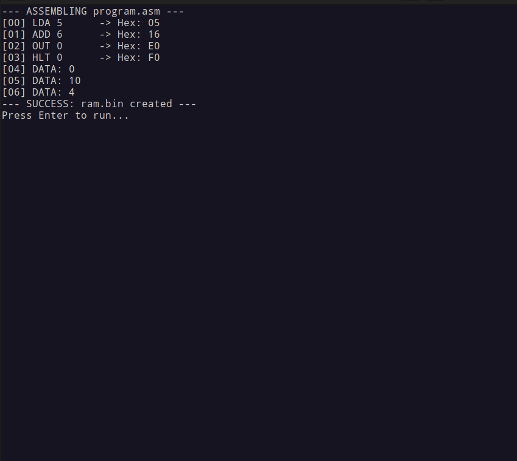

<div style="text-align: center;">
<pre style="
        background: transparent; 
        border: none; 
        font-family: monospace; 
        display: inline-block; 
        text-align: left; 
        color: inherit;">
███████╗  ██████╗  ██████╗  ██████╗  ██╗   ██╗
██╔════╝ ██╔═══██╗ ██╔══██╗ ██╔══██╗ ██║   ██║
███████╗ ████████║ ██████╔╝ ██████╔╝ ██║   ██║
╚════██║ ██╔═══██║ ██╔═══╝  ██╔═══╝  ██║   ██║
███████║ ██║   ██║ ██║      ██║      ╚██████╔╝
╚══════╝ ╚═╝   ╚═╝ ╚═╝      ╚═╝       ╚═════╝
</pre>
</div>

<h1 align="center"> (Simple As Possible Processing Unit) </h1>

<h3 align="center">This is not a high-level emulator, every component is explicitly modeled to simulate real hardware behavior.</h3>



## 🎯 Purpose

SAPPU is designed to help you learn **both C programming and computer architecture** simultaneously:

- **C Programming**: Structs, pointers, bitwise operations, modular design
- **Digital Logic**: Gates, flip-flops, registers, tri-state buffers
- **CPU Architecture**: Fetch-execute cycle, control signals, bus architecture
- **Assembly Language**: Writing and understanding low-level instructions

## 📑 Index

- [Architecture Overview](#-architecture-overview)
- [Instruction Set](#-instruction-set)
- [Writing Programs](#-writing-programs)
- [Building](#-building)
- [Running](#-usage)
- [Project Structure](#-project-structure)
- [Microcode (Fetch-Execute Cycle)](#microcode-fetch-execute-cycle)
- [Control Signals Reference](#-control-signals-reference)
- [Learning Resources](#-learning-resources)

## 🏗️ Architecture Overview

<div style="text-align: center;">
<pre style="
        background: transparent; 
        border: none; 
        font-family: monospace; 
        display: inline-block; 
        text-align: left; 
        color: inherit;">
                    ┌─────────┐             ┌───┐
      ┌────────────▶│   ALU   │◀────────────│ B │
      │             │   +/-   │             └─┬─┘
      │             └────┬────┘               ▲
      │                  │                    │
    ┌─▼─┐                │                    │
    │ACC│                │                    │
    └─┬─┘                │                    │
      ▲                  │                    │
      │                  │                    │
┌─────▼──────────────────▼────────────────────▼──────────────────┐
│                        8-BIT BUS                               │
└─────┬────────┬─────────┬──────────┬──────────────────┬─────────┘
      │        │         │          │                  │
      │        │         │          │                  │
    ┌─▼─┐    ┌─▼─┐     ┌─▼─┐      ┌─▼─┐              ┌─▼─┐
    │PC │    │MAR│────▶│RAM│      │IR │              │OUT│
    └───┘    └───┘     └───┘      └─┬─┘              └───┘
      ▲                             │
      │                             │
      │                             ▼
      │                       ┌──────────┐
      │                       │ CONTROL  │
      └───────────────────────│   UNIT   │
                              └──────────┘
</pre>
</div>

### Components

| Component | Description |
|-----------|-------------|
| **PC** | Program Counter - holds address of next instruction |
| **MAR** | Memory Address Register - selects RAM address |
| **RAM** | 8 bytes of memory (addresses 0-7) |
| **IR** | Instruction Register - holds current instruction |
| **ACC** | Accumulator - main working register |
| **B** | B Register - second operand for ALU |
| **ALU** | Arithmetic Logic Unit - performs add/subtract |
| **OUT** | Output Register - displays results |
| **Control Unit** | Generates control signals based on instruction |

## 📋 Instruction Set

| Mnemonic | Opcode | Format | Description |
|----------|--------|--------|-------------|
| `LDA` | `0000` | `LDA addr` | Load value from RAM[addr] into Accumulator |
| `ADD` | `0001` | `ADD addr` | Add RAM[addr] to Accumulator |
| `SUB` | `0010` | `SUB addr` | Subtract RAM[addr] from Accumulator |
| `OUT` | `1110` | `OUT` | Output Accumulator value to display |
| `HLT` | `1111` | `HLT` | Halt the CPU |
|Others yet to come...! |


## 📝 Writing Programs

**RAM is 8 bytes (addresses 0-7).** Each line in your assembly file corresponds to a RAM address. Use `DAT` to store data values at specific addresses.

```asm
# Address | Instruction
# --------|------------
# 0       | LDA 5       # Load 10 from address 5
# 1       | ADD 6       # Add 4 from address 6
# 2       | OUT         # Output result (14)
# 3       | HLT         # Stop
# 4       |             # Unused padding
# 5       | DAT 10      # First number (10)
# 6       | DAT 4       # Second number (4)
```

### Instruction Format

Each instruction is 8 bits:
```
┌───────────────┬───────────────┐
│   OPCODE      │   OPERAND     │
│   (4 bits)    │   (4 bits)    │
└───────────────┴───────────────┘
     7 6 5 4         3 2 1 0
```

## 🛠️ Building

```bash
# Builds machine and assembler
make
```

## 🚀 Usage

### Quick Start

```bash
# Assemble and run in one command
./sap src/program.asm

# With auto mode (runs at 2 Hz by default)
./sap src/program.asm -auto

# With custom clock speed (10 Hz)
./sap src/program.asm -auto 10
```

### Manual Steps

```bash
# 1. Assemble your program
./assembler src/program.asm

# 2. Run the simulator
./run ram.bin           # Manual mode (press Enter to step)
./run ram.bin -auto     # Auto mode at default Hz
./run ram.bin -auto 5   # Auto mode at 5 Hz
```


## 📁 Project Structure

```
SAPPU/
├── Makefile            # Build configuration
├── sap                 # Assemble & run script
├── README.md           # This file
└── src/
    ├── gates.c/h       # Logic gates (AND, OR, NOT, XOR, etc.)
    ├── memory.c/h      # Registers, RAM, flip-flops
    ├── alu.c/h         # Arithmetic Logic Unit
    ├── control.c/h     # Control unit & signal generation
    ├── computer.c/h    # Main computer integration
    ├── test.c          # Simulator with visualization
    ├── assembler.c     # Assembly to binary converter
    └── loader.c        # Binary file inspector
```

## Microcode (Fetch-Execute Cycle)

### Fetch Phase (same for all instructions):
| Step | Signals | Action |
|------|---------|--------|
| T1 | `CO MI` | PC → Bus → MAR |
| T2 | `RO II` | RAM[MAR] → Bus → IR |
| T3 | `CE` | PC++ |

### Execute Phase (instruction-specific):

**LDA** (Load Accumulator):
| Step | Signals | Action |
|------|---------|--------|
| T4 | `IO MI` | IR[3:0] → Bus → MAR |
| T5 | `RO AI` | RAM[MAR] → Bus → ACC |

**ADD** (Add to Accumulator):
| Step | Signals | Action |
|------|---------|--------|
| T4 | `IO MI` | IR[3:0] → Bus → MAR |
| T5 | `RO BI` | RAM[MAR] → Bus → B |
| T6 | `EO AI` | ALU(ACC+B) → Bus → ACC |

**SUB** (Subtract from Accumulator):
| Step | Signals | Action |
|------|---------|--------|
| T4 | `IO MI` | IR[3:0] → Bus → MAR |
| T5 | `RO BI` | RAM[MAR] → Bus → B |
| T6 | `EO AI SU` | ALU(ACC-B) → Bus → ACC |

**OUT** (Output):
| Step | Signals | Action |
|------|---------|--------|
| T4 | `AO OI` | ACC → Bus → OUT |

**HLT** (Halt):
| Step | Signals | Action |
|------|---------|--------|
| T4 | `HLT` | Stop clock |


## 🔌 Control Signals Reference

| Signal | Name | Description |
|--------|------|-------------|
| `CO` | Counter Out | PC outputs to bus |
| `CE` | Counter Enable | Increment PC |
| `MI` | MAR In | Load MAR from bus |
| `RO` | RAM Out | RAM outputs to bus |
| `II` | IR In | Load IR from bus |
| `IO` | IR Out | IR operand to bus |
| `AI` | Accumulator In | Load ACC from bus |
| `AO` | Accumulator Out | ACC outputs to bus |
| `BI` | B Register In | Load B from bus |
| `EO` | ALU Out | ALU outputs to bus |
| `SU` | Subtract | ALU subtract mode |
| `OI` | Output In | Load OUT from bus |
| `HLT` | Halt | Stop execution |

## 🎓 Learning Resources

This project is inspired by:
- **SAP-1** architecture from "Digital Computer Electronics" by Malvino & Brown
- **Ben Eater's** 8-bit breadboard computer series

## 📜 License

This project is licensed under the MIT License - see the [LICENSE](LICENSE) file for details.

Copyright (c) 2026 Matteo Tacconi (teotexeplus@gmail.com)